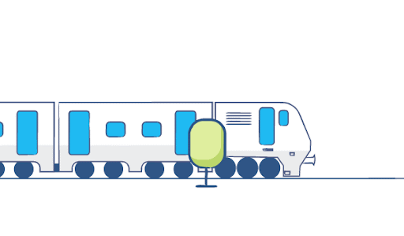

  <H1> Bonjour,Je suis STIB ANALYTICS ! </H1> 

Hi! I am an Interactive dashboard for STIB! I can be used in many ways. You can check my features in [How to use me](#how-to-use-me) Section. You can find my code [here](https://github.com/ULB2022/stib_data_mining). I am created to help you. To meet me creators, please check [Developers](#developers) Section.  Hope you like me.😊 
 

  

 

# How to Use Me
I have multiple options to choose from and multiple to click on.
### Options to Choose
1. **Select Transport:** Choose which transport you want to analyze. I have three options `Metro`, `Bus` and `Tram`. By default `Tram` is chosen.
2. **Select Line:** Choose which line which need to be analyzed. It will keep changing for each Transport.
3. **Select Direction:** `0` and `1` are two directions which can be selected for to and fro direction.
4. **Select Stop:** It will be populated after selection of `Transport`, `Line` and `Direction`. It will have `Stop Id` and `Stop Name`.
5. **Select Date:** It will be populated after selection of  `Transport`, `Line` , `Direction` and `Stop`. It will provide the options for all the data available.

### Buttons to Click
1. **ADD DELAY GRAPH:** After selection of all the above options. It can be clicked and It will show the `bar` graph in which x axis will be the time at which vehicle need to be on stop and after how much time it really come arrived. On this graph line punctuality and regularity is also shown.
2. **ADD HEADWAY GRAPH:** After selection of all the options it will show the scheduled the bar graph between the `scheduled arrival time` and `Inter arrival time`.  Inter arrival time is having 2 parts. First is 
scheduled and real interval time. On this graph line punctuality and regularity is also shown.
3. **ADD TABLE:** It will show the tabular format of data which can be useful to see processed arrival time, delays and stop sequence. It will be beneficial to compare 2 stops together.
4. **ADD MAP:** Only   `Transport`, `Line` and `Direction` need to be chosen for this. It can be used to see the stops and direction in which vehicle need to move. It gives bird view about the line.
5. **WAITING TIME:** ***All*** the options need to be chosen. It will show `Schudled waiting time`, `Actual waiting time` and `Excess waiting time`.
6. **DAY ISSUES:** ***All*** the options need to be chosen. It will show all the issue happened on the on that day in map.
7. **CLEAR DASHBOARD:** Click on it to clear all the graphs and maps from the dashboard.

   >>  ***All tables are filterable and can be sorted according to it's values.***

## DEVELOPERS

Adina | Koumudi | Prashant | Rishika |
--- | --- | --- | --- |
|  |  |  ||

